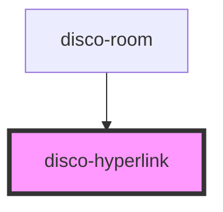

# disco-hyperlink

<!-- Auto Generated Below -->

## Properties

| Property          | Attribute          | Description | Type      | Default |
| ----------------- | ------------------ | ----------- | --------- | ------- |
| `inUse`           | `in-use`           |             | `boolean` | `false` |
| `peepConnections` | `peep-connections` |             | `string`  | `"0"`   |

## Events

| Event                 | Description | Type                  |
| --------------------- | ----------- | --------------------- |
| `discoHyperlinkClick` |             | `CustomEvent<string>` |

## Dependencies

### Used by

 - [disco-room](../disco-room)

### Graph

----------------------------------------------

*Built with [StencilJS](https://stenciljs.com/)*
